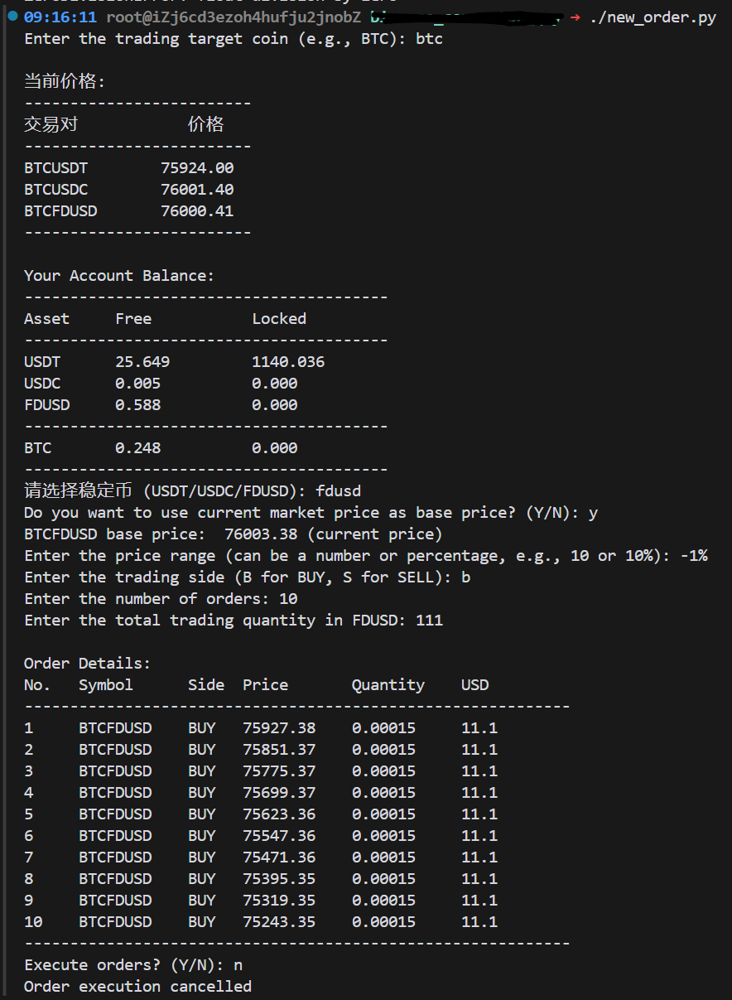

# BINANCE_tools
用于在binance上自动下单的一些脚本.
## 依赖安装
```bash
pip install binance-connector
```

## 配置
在`config.json`中配置你的api_key和api_secret.

```json
{
  "api_key": "vmPUZE6mv9SD5VNHk4HlWFsOr6aKE2zvsw0MuIgwCIPy6utIco14y7Ju91duEh8A",
  "api_secret": "NhqPtmdSJYdKjVHjA7PZj4Mge3R5YNiP1e3UZjInClVN65XAbvqqM6A7H5fATj0j"
}
```
注意：这些只是示例，请自行替换。

## 关于api_key和api_secret
需要在binance上创建一个api_key, 设置安全权限，设置交易对白名单，设置IP白名单.
安全设置很重要，切记。

最好在墙外做，暂时不确定这些是否会被墙内封锁.

## 挂网格买/卖单
```bash
python3 new_order.py
```

他会提示一些问题，输入交易对，输入数量，输入价格，然后下单.

基本策略是网格下单，根据您输入的价格范围，会自动计算出价格和数量和订单数，然后自动挂单。价格范围需要由两个参数来确定，一个是base price， 一个是涨跌幅百分比。




我们使用实时价格做为 base price，这个价格是自动通过查询交易所得出的（当然也可以自行输入一个其他价格），上界是9%，方向是卖（s），一共挂10单，总计卖出额度3422 USD。再次确认挂单信息，然后选择执行，或者取消。

此时查看binance账户，可以看到已经挂了10个卖单:


## 取消某交易对的所有订单
```bash
python3 cancel_open_order.py
```

他会提示输入交易对，然后取消该交易对的所有订单。

## 其他

掌握了挂单方式，binance API就妙不可言了，你可以搭建自己的交易机器人，创造被动收入。
## Documentation

[https://binance-connector.readthedocs.io](https://binance-connector.readthedocs.io)

[https://github.com/binance/binance-connector-python/blob/master/README.md](https://github.com/binance/binance-connector-python/blob/master/README.md)